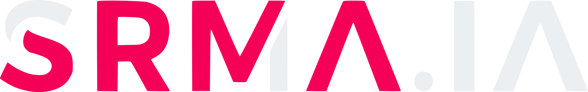
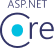
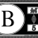

  

    
    <h1 style="color: #ffffff;" align="center">srma.ia</h1>
  

Beleza? Este é o meu repositório/portfólio, onde você pode encontrar informações sobre mim e meus projetos. Se você gostou do que viu, entre em contato comigo para discutirmos como posso ajudar você a alcançar seus objetivos.

Abaixo segue minhas principais stacks...

## Principáis tecnologias utilizadas

### .Net

O .NET é uma plataforma de desenvolvedor multiplataforma de código aberto gratuita para criar muitos tipos diferentes de aplicativos. O ASP.NET amplia a plataforma de desenvolvedor do .NET com ferramentas e bibliotecas específicas para a criação de aplicativos web. O C# é sua principal linguagem de programação, simples, moderna, com foco no objeto e de tipo seguro. 

Bibliotecas comumente utilizadas por mim:

| [ASP.Net](https://www.nuget.org/packages/Microsoft.AspNetCore.OpenApi) | [Entity Framework](https://www.nuget.org/packages/Microsoft.EntityFrameworkCore) | [AutoMapper](https://www.nuget.org/packages/AutoMapper) | [Bogus](https://www.nuget.org/packages/Bogus) | [FluentValidation](https://www.nuget.org/packages/FluentValidation) | [Serilog](https://www.nuget.org/packages/Serilog) | [xunit](https://www.nuget.org/packages/xunit) | [FastReports](https://www.nuget.org/packages/FastReport.OpenSource) | [JWT](https://www.nuget.org/packages/Microsoft.AspNetCore.Authentication.JwtBearer)
|:--:|:--:|:--:|:--:|:--:|:--:|:--:|:--:|:--:|
| |  |  |  |  |  |  |  | 

### Next.js/React

O React é uma biblioteca JavaScript para criar interfaces de usuário (UI) reativas baseado no conceito de componentes, que são blocos de construção reutilizáveis que podem ser combinados para criar interfaces complexas. uma biblioteca popular para criar aplicativos web, incluindo sites, aplicativos móveis e aplicativos de desktop.

Bibliotecas comumente utilizadas por mim:

| [Next.js](https://nextjs.org/) | [React](https://react.dev/) | [Redux](https://redux.js.org/) | [Material React Table](https://material-react-table.com/) | [React Hook Form](https://www.npmjs.com/package/react-hook-form) | [Axios](https://www.npmjs.com/package/axios) | [ReactRouter](https://www.npmjs.com/package/react-router-dom) | [Prisma](https://www.prisma.io/) | [MUI](https://www.npmjs.com/package/@mui/material) | [Jest](https://jestjs.io/) | [Babel](https://babeljs.io/)| [ESLint](https://www.npmjs.com/package/eslint) | [Zod](https://zod.dev/) | [JWT-Decoder](https://www.npmjs.com/package/jwt-decode) | [React Icons](https://react-icons.github.io/react-icons/) | [Unform](https://www.npmjs.com/package/@unform/core) | [Fuse.js](https://www.fusejs.io/)
|:--:|:--:|:--:|:--:|:--:|:--:|:--:|:--:|:--:|:--:|:--:|:--:|:--:|:--:|:--:|:--:|:--:|
 |  |  |  |  |  |  |  |  |  | |  |  |  |  |  |  

### Flask
O Flask é um micro framework de desenvolvimento web em Python, projetado para ser leve e modular, permitindo que os desenvolvedores escolham as bibliotecas e ferramentas que desejam usar. É fácil de configurar e usar, o que o torna uma escolha popular para criar protótipos e aplicativos web de pequeno a médio porte. O Flask proporciona uma base sólida com extensões que permitem adicionar funcionalidades conforme necessário.

Bibliotecas comumente utilizadas por mim:

| [Flask](https://flask.palletsprojects.com/en/3.0.x/) | [Milvus](https://milvus.io/)
|:--:|:--:|
 | 

## Últimos projetos desenvolvidos

### [LNSF - Lar Nossa Senhora de Fátima](https://github.com/LovelaceLines/LNSF/blob/development)

O sistema LNSF foi desenvolvido com um propósito fundamental: aprimorar a eficiência das operações realizadas pelos servidores dedicados ao Lar Nossa Senhora de Fátima. Este sistema visa a melhoria do processo de gestão dos pacientes e quartos, além de automatizar tarefas complexas, anteriormente realizadas de forma manual, como a emissão de relatórios.

### [Lovelace Lines - Landpage + Blog](https://github.com/LovelaceLines/lovelacelines/tree/development)

Este repositório abriga a landing page e o blog da Lovelace Lines. Desenvolvido com uma combinação de tecnologias modernas, o projeto oferece uma experiência dinâmica e eficiente aos usuários com componentes SSR, CSR e Api de consulta.

### [MiniHub](https://github.com/usrmaia/MiniHub)

O MiniHub é um sistema de gerenciamento de arquivos para empresas e projetos. Com ele, é possível criar, editar, compartilhar e excluir arquivos, além de gerenciar usuários, permissões e flags. Tudo isso na rede interna da sua empresa ou projeto.

